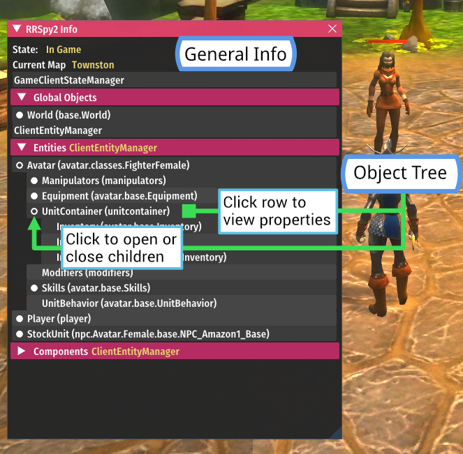
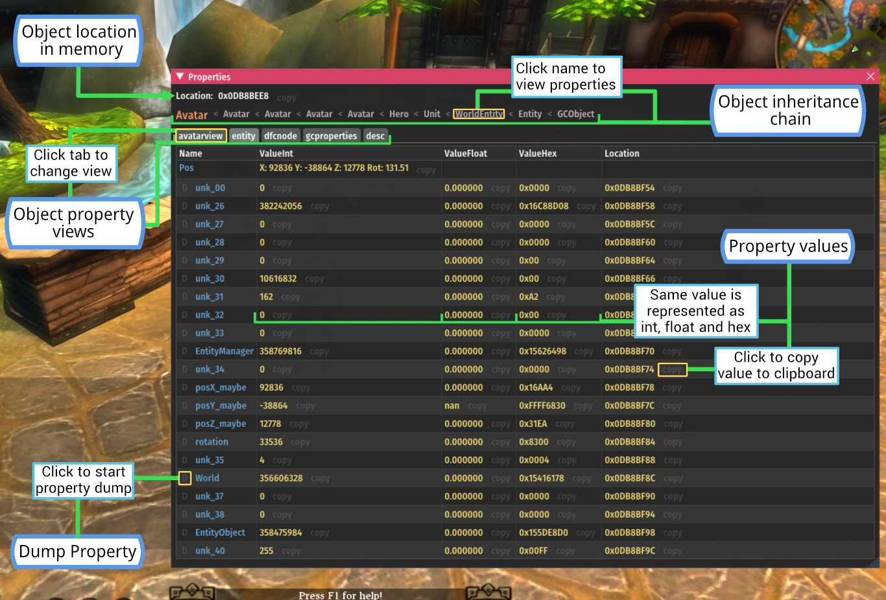

# RRSpy2

IMGUI tool for viewing and extracting data from a running Dungeon Runners client.

## How to compile

This is based on the setup I am using but I have not tested these steps from a fresh environment.
This has only been tested while using Jetbrains Clion to build.

1. Install MSYS2
2. Setup mingw32
   toolchain (https://docs.epics-controls.org/projects/how-tos/en/latest/getting-started/installation-windows-msys2.html)
3. Install required libs through MSYS2->`pacman`, make sure to install the `mingw-w64-i686` version of all libraries (
   check [CMakeLists.txt](CMakeLists.txt))
4. (Optional) Add env var `DR_GAME_DIR="{{DUNGEON_RUNNERS_GAME_PATH}}"` and replace the `DUNGEON_RUNNERS_GAME_PATH` with
   your game path. This will automatically copy the RRSpy2 dll to the correct location on build
5. Compile target RRSpy2 with CMAKE (
   example: `cmake.exe --build F:\Projects\DungeonRunners\RRSpy2\cmake-build-debug --target RRSpy2 -- -j 19`)

## How to use

1. Ensure you have `d3d9.dll` available in `C:\Windows\System32\d3d9.dll`
2. Copy compiled dll file to game directory with the name `d3d9.dll`
3. Copy [fonts](./fonts) to game directory
4. Launch the game and press `F1` to toggle the UI

## Features

* Display game state information (In Game/Login screen etc.) and current map name
* Display tree of objects/components currently available
* Display all known and unknown object properties + memory locations for those properties as int, float and hex
    * Copy all values and memory addresses to clipboard
* Modify any property value (int or float fields only)
* View properties of all objects in inheritance chain (e.g. `Avatar < Hero < Unit < WorldEntity < Entity < GCObject`)
* Display attached data object properties (e.g. `Avatar: AvatarDesc` or `Avatar : GCProperties`)
* (Experimental) DataStream - Dump property value over time, will output the property value every tick into a log file
  in JSON
  format with timestamps for further analysis **(WARNING you must restart the game to stop dumping)**,
  Create `logs/datastream` directory in main DungeonRunners game dir for this to work.
* Supreme instability - it will crash

## Screenshots

## Contributing

Contributions are welcome, try not to break things too much.

1. Fork
2. Open PR
3. Get approved and merge!

## License

[GNU GPLv3](https://choosealicense.com/licenses/gpl-3.0/)
